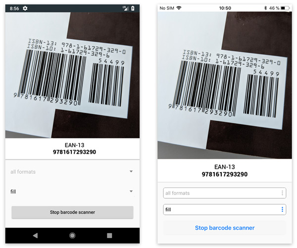

# Tabris.js Barcode Scanner Plugin

A barcode scanner widget for [Tabris.js](https://tabrisjs.com), allowing to scan various types of barcodes.



## General usage

The BarcodeScannerView can be embedded into the Tabris view hierarchy like any other view. Once embedded it show a blank screen until the [`start()`](#startformats) method has been called. At that point the device camera is show in the views bounds and barcode detection is enabled. The [`detect`](#detect) event will fire once a barcode is detected in the camera. The callback might fire multiple times for the same barcode. Barcode scanning continues until [`stop()`](#stop) is called. At that time the camera is deactivated. It is recommended to stop barcode detection when not needed as it draws considerable power. 

## Supported barcode formats

The plugin supports the following barcode formats.

| Barcode            | Name              |   iOS | Android |
| ------------------ | :---------------: | :---: | :-----: |
| UPC-A              | `upcA`            | ✓     | ✓       |
| UPC-E              | `upcE`            | ✓     | ✓       |
| Code 39            | `code39`          | ✓     | ✓       |
| Code 39 Mod 43     | `code39Mod43`     | ✓     |         |
| Code93             | `code93`          | ✓     | ✓       |
| Code128            | `code128`         | ✓     | ✓       |
| EAN-8              | `ean8`            | ✓     | ✓       |
| EAN-13             | `ean13`           | ✓     | ✓       |
| PDF417             | `pdf417`          | ✓     | ✓       |
| QR                 | `qr`              | ✓     | ✓       |
| Aztec              | `aztec`           | ✓     | ✓       |
| Interleaved 2 of 5 | `interleaved2of5` | ✓     |         |
| ITF14              | `itf`             | ✓     | ✓       |
| DataMatrix         | `dataMatrix`      | ✓     | ✓       |
| Codabar            | `codabar`         |       | ✓       |

## Example

The following snippet shows how the `tabris-plugin-barcode-scanner` plugin can be used in a Tabris.js app:

```javascript
let scanner = new esbarcodescanner.BarcodeScannerView({
  left: 0, right: 0, top: 0, bottom: 0
}).on('detect', (e) => console.log(`Detected ${e.format} code with data ${e.data}`))
  .on('error', (e) => console.log(e.error))
  .appendTo(tabris.ui.contentView);
scanner.start(['qr', 'ean13']);
```
A more elaborate example can be found in the [example](example/) folder. It provides a Tabris.js project that demonstrates the various features of the `tabris-plugin-barcode-scanner` widget. Consult the [README](example/README.md) of the example for build instructions.

## Integrating the plugin
The Tabris.js website provides detailed information on how to [integrate custom widgets](https://tabrisjs.com/documentation/latest/build#adding-plugins) in your Tabris.js app. To add the plugin to your app add the following entry in your apps `config.xml`:


```xml
<!-- Not yet released to npm -->
<!-- <plugin name="tabris-plugin-barcode-scanner" spec="^1.0.0" /> -->
```

To fetch the latest development version use the GitHub URL:

```xml
<plugin name="tabris-plugin-barcode-scanner" spec="https://github.com/eclipsesource/tabris-plugin-barcode-scanner.git" />
```

### iOS

The plugin requires key-value entry. `NSCameraUsageDescription` with description has to be added to the `Info.plist` file of your app to work correctly. Please include this configuration in your `config.xml` file. 

```xml
<edit-config target="NSCameraUsageDescription" file="*-Info.plist" mode="merge">
  <string>Your custom description.</string>
</edit-config>
```

## API

The widget api consists of the object `esbarcodescanner.BarcodeScannerView` with the following properties, events and methods.

### Properties

The following properties can be applied on top of the [common Tabris.js widget properties](https://tabrisjs.com/documentation/latest/api/Widget#properties):

##### `camera` : _string_, supported values: `front`, `back`, default: `back`

The camera to use when scanning for barcodes. Has to be set in the constructor of the `BarcodeScannerView`. 

##### `scaleMode` : _string_, supported values: `fit`, `fill`, default: `fit`

How to scale the camera frame inside the bounds of the `BarcodeScannerView`. Setting the `scaleMode` to `fit` shows the full camera frame while potentially leaving blank space on the sides. Setting the `scaleMode` to `fill` will make the camera frame cover the view bounds while potentially clipping some of the camera frame edges.

##### `active` : _boolean_, readonly

Calling  [`start()`](#startformats) sets the `active` property to `true`. Calling [`stop()`](#stop) sets the `active` property to `false`. When an [`error`](#error) occurs or the widget is disposed the `active` state is also set to`false`.

### Events

#### `detect`

Fired when a barcode has been detected. The rate of `detect` events varies from platform to platform. It is very likely to receive duplicate events for the same barcode.

##### Event parameter
* `format`: _string_
  * The format of the detected barcode
* `data`: _string_
  * The data contained in the barcode

#### `error`

Fired when an error during the `BarcodeScannerView`s lifecycle happened. After an an error occurred no further [`detect`](#detect) event will be fired and the widget becomes unusable.

##### Event parameter
* `error`: _string_
  * A message providing details about the error
  
#### `activeChanged`
  
Fired when the [`active`](#active) state of the widget changes. Either by calling [`start()`](#startformats)/[`stop()`](#stop), receiving an [`error`](#error) event or disposing the widget.

### Methods

#### `start([formats])`

Enables the camera and starts scanning for barcodes. When started, the barcode scanner continuously fires the [`detect`](#detect) event as soon as it finds a barcode in its view. To end barcode detection [`stop()`](#stop) should be called or the widget should be disposed. Not disabling the barcode scanner will consume a lot of unnecessary processing power. The given `formats` array can be used to narrow down the detected barcodes.

Example:
```js
scanner.start(['qr']);
```

##### Parameter

* `formats` : _string[]_
  * The optional `formats` array allows to limit the detection of barcodes to only the given formats. The supported barcode names can be obtained from the [list of supported barcodes](#supported-barcode-formats). If `formats` is omitted all barcodes supported on the platform will be detected.
  
#### `stop()`

Stops the barcode scanning and disables the camera.

Example:
```js
scanner.stop();
```

## Compatibility
  
Compatible with [Tabris.js 2.3.0](https://github.com/eclipsesource/tabris-js/releases/tag/v2.3.0)

### Supported platforms

 * Android
 * iOS

## Development of the widget

While not required by the consumer or the widget, this repository provides a `project` folder that contains platform specific development artifacts. These artifacts allow to more easily consume the native source code when developing the native parts of the widget.

### Android

The project provides a gradle based build configuration, which also allows to import the project into Android Studio.

In order to reference the Tabris.js specific APIs, the environment variable `TABRIS_ANDROID_PLATFORM` has to point to the Tabris.js Android Cordova platform root directory.

```bash
export TABRIS_ANDROID_PLATFORM=/home/user/tabris-android-cordova
```
 The environment variable is consumed in the gradle projects [build.gradle](project/android/build.gradle) file.

## Copyright

 See [LICENSE](LICENSE) notice.
